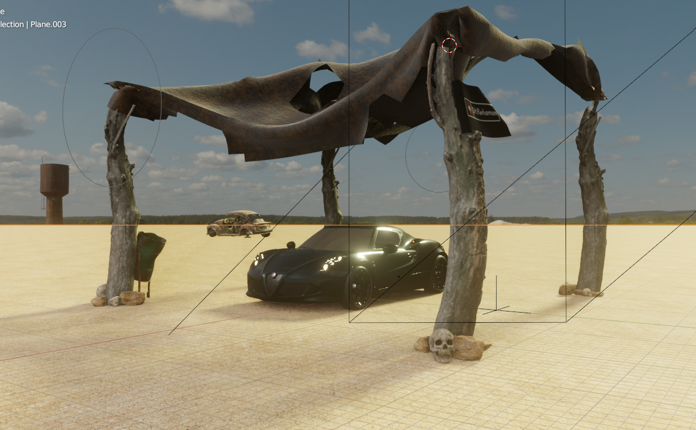

# Rustic Reverie A Vintage Car in Tranquil Sands (3D Modeling)
The Car and Sand Environment with Old Theme is a 3D scene created in Blender that showcases a vintage-themed setting featuring a car and a sandy area. This environment is designed to evoke a nostalgic atmosphere and provide a visually appealing scene for various purposes, such as animations, visualizations, or game development.

## Table of Contents

- [Installation](#installation)
- [Contributing](#contributing)
- [Feedback and Suggestions](#feedback-and-suggestions)
## Installation

 I have uploaded all the files in Google Drive because of storage issues. 

 1. Visit my [Google Drive](https://drive.google.com/drive/folders/1uJM4xdHToFRzqqbF9vACELU_tBFUli5q?usp=sharing)
 2. Install the latest Blender Application
 3. Open Blend file ( Make sure your system having medium graphics card) 

## Contributing

Contributions are welcome! If you'd like to contribute to this project, please follow these steps:

 1. Customize the blend file
 2. Send a Snap of your customization on my [WhatsApp](https://api.whatsapp.com/send/?phone=919777795786&text=Hello%20Shaikh%20Habibur%20Rehaman,%20I%20get%20this%20no.%20from%20your%20Github%20&type=phone_number&app_absent=0)

## Feedback and Suggestions

If you have any feedback or suggestions for improving this model, please feel free to reach out to me. You can contact me via email at s.h.rehaman.art@gmail.com or through WhatsApp at [Just Say Hello 👋 ](https://api.whatsapp.com/send/?phone=919777795786&text=Hello%20Shaikh%20Habibur%20Rehaman,%20I%20get%20this%20no.%20from%20your%20Github%20&type=phone_number&app_absent=0)
